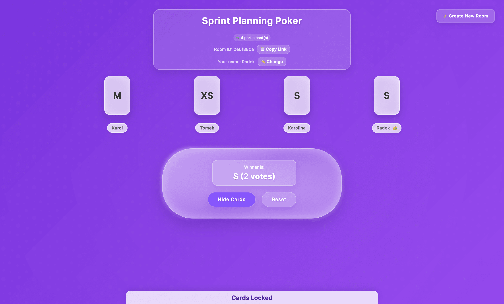

# Planning Poker

A real-time collaborative estimation tool for agile development teams built with Angular and Firebase.

## Overview

Planning Poker is a web application that helps development teams estimate user stories and tasks during sprint planning sessions. Team members can join virtual rooms, select estimation cards, and reach consensus on story points in real-time.

## Key Features

-   **Real-time Collaboration**: Multiple participants can join rooms and see updates instantly
-   **Interactive Card Selection**: Choose from standard Planning Poker card values (XXS, XS, S, M, L, XL, XXL, ?)
-   **Room Management**: Create and join rooms with unique room codes
-   **Live Voting**: See participant votes in real-time with reveal functionality
-   **Admin Controls**: Room creators can manage sessions and reset votes
-   **Glassmorphism UI**: Modern, elegant interface with smooth animations

## Technology Stack

-   **Frontend**: Angular 20 with standalone components
-   **Backend**: Firebase Realtime Database
-   **Styling**: SCSS with custom animations and glassmorphism design
-   **Build Tool**: Angular CLI with modern build optimizations

## Quick Start

1. Clone the repository
2. Navigate to the `planning-poker-app` directory
3. Follow the setup instructions in the app's README

## Demo

Create or join a room and start estimating with your team in seconds!

Live Site available at: [planning-poker-venrofi.netlify.app/](https://planning-poker-venrofi.netlify.app/)

## License

This project is licensed under the MIT License - see the [LICENSE](LICENSE) file for details.
